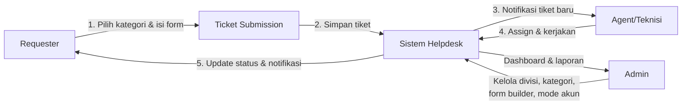
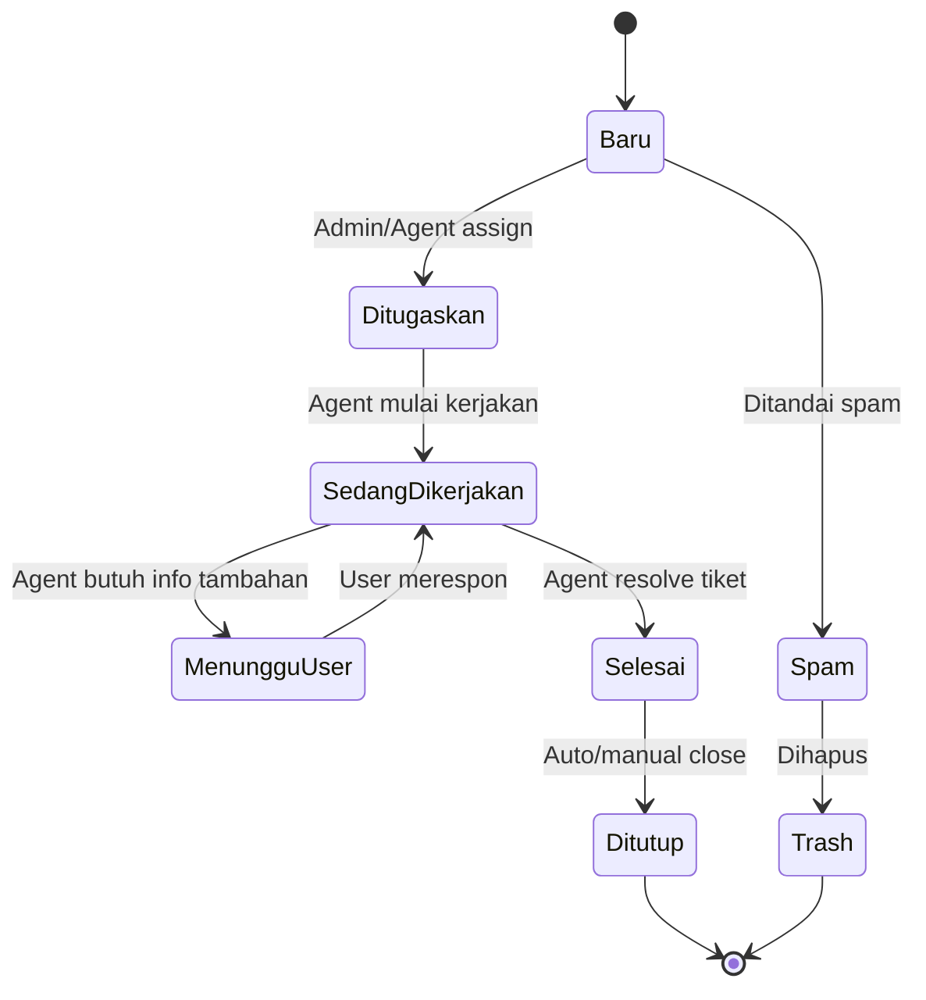
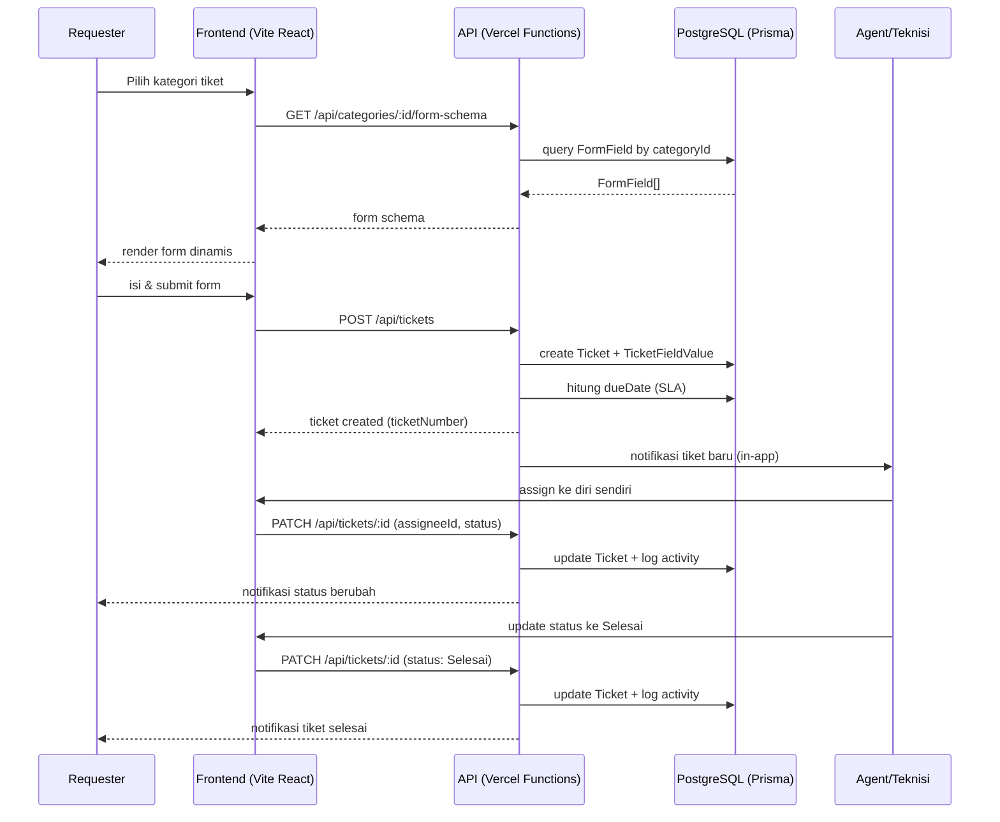
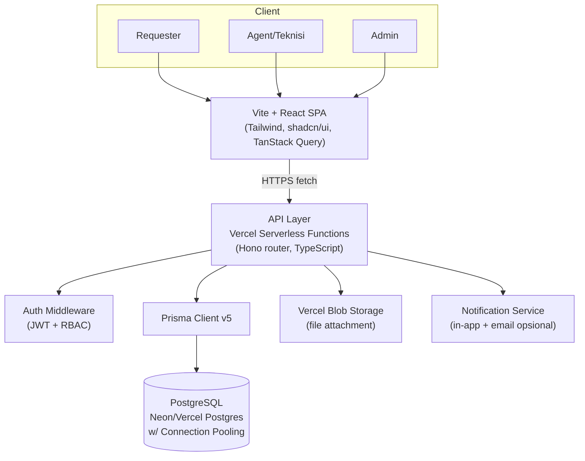
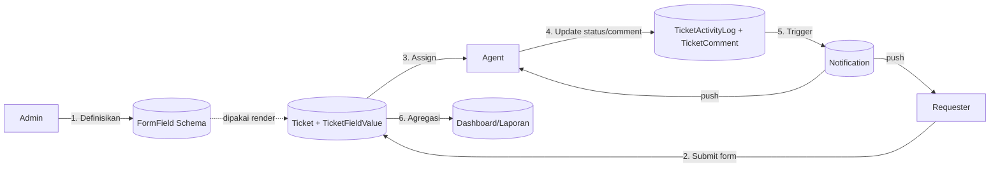
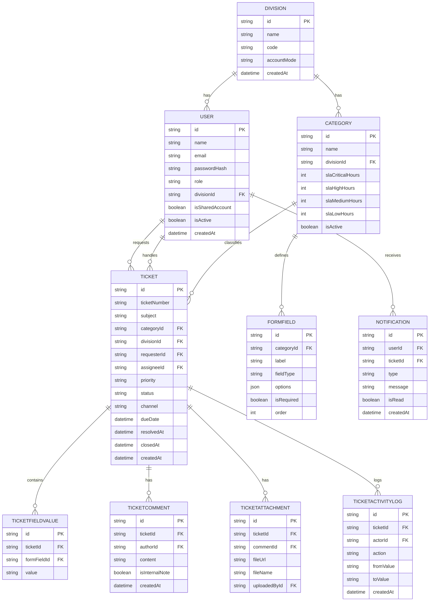

# PRD — Sistem Helpdesk Internal Multi-Departemen

## Assumptions
- Deployment bersifat **single-tenant** untuk satu kantor/perusahaan (bukan SaaS multi-tenant) — semua divisi (IT, HR, GA, Finance, dll) berada dalam satu instance yang sama.
- Mode akun (**Individual** vs **Shared**) adalah pengaturan **per-divisi**, di-toggle oleh Super Admin kapan saja, dan berlaku untuk seluruh anggota divisi tersebut.
- Mode **Shared Account** hanya berlaku untuk sisi **Requester/Pemohon** (staf yang mengajukan tiket, cocok untuk divisi "gaptek" seperti produksi/gudang). Agent/Teknisi dan Admin **selalu** punya akun individual, demi akuntabilitas penugasan dan audit trail performa.
- Saat divisi di-toggle **Individual → Shared**: akun individual existing di-*disable* (bukan dihapus) dan satu akun bersama baru dibuatkan untuk divisi tsb; riwayat tiket lama tetap tertaut ke user asli (tidak berubah kepemilikan) demi audit trail.
- Saat divisi di-toggle **Shared → Individual**: akun shared di-*disable*, dan admin diminta mengundang/membuat akun individual untuk tiap staf di divisi tsb.
- **"Tambahan kolom"** pada form tiket diartikan sebagai kemampuan admin menambah custom field/pertanyaan baru lewat Form Builder (bukan menambah kolom database manual) — tiap field baru otomatis tersimpan sebagai baris baru di tabel `FormField`, dan jawabannya masuk ke `TicketFieldValue`.
- Form Builder mendukung tipe field: **Short Text, Paragraph, Dropdown, Multiple Choice (Radio), Checkboxes, Date, Number, File Upload** — mengikuti pola Google Forms, dengan urutan field yang bisa diatur via drag & drop.
- Frontend & backend **digabung dalam satu repo Vite project** yang di-deploy ke Vercel: kode React di root untuk FE, folder `/api` berisi Serverless Functions untuk BE — bukan framework SSR seperti Next.js.
- Prisma v5 dipilih sebagai ORM sesuai permintaan eksplisit user; database menggunakan PostgreSQL (direkomendasikan **Neon** atau **Vercel Postgres**) karena mendukung *connection pooling* yang wajib di lingkungan serverless.
- File attachment disimpan di object storage eksternal (**Vercel Blob**), bukan di filesystem server, karena Vercel Serverless Functions bersifat *stateless/ephemeral*.
- Notifikasi MVP hanya **in-app** (bell icon, mirip kedua gambar referensi); email masuk kategori Should Have, WhatsApp/Telegram masuk Nice to Have.
- Tidak ada WebSocket server terpisah (tidak didukung native oleh Vercel serverless) — notifikasi & update board memakai *polling* ringan (interval ± 15 detik) via TanStack Query untuk MVP.
- Autentikasi memakai JWT custom (httpOnly cookie) dengan RBAC 4 role: Super Admin, Division Admin, Agent, Requester.
- SLA dihitung otomatis dari kombinasi **Priority × Category**, menghasilkan `dueDate` yang menentukan badge "Overdue" di Board View (mengacu pada pola di gambar referensi IT Approval Workspace).
- Referensi visual: **List View** mengikuti pola *QTicketing* (sidebar Ticket Views + tabel sortable), **Board View** mengikuti pola *IT Approval Workspace* (kanban per status + filter panel).

---

## 1. Overview
Project ini adalah **Sistem Helpdesk Internal Multi-Departemen** berbasis web yang dipakai lintas divisi kantor (IT, HR, GA, Finance, dan divisi lain) dalam satu platform terpusat, dengan kemampuan menyesuaikan diri terhadap tingkat kesiapan digital tiap divisi — mendukung akun individual maupun akun bersama per divisi secara *toggle-able* oleh admin.

Masalah yang diselesaikan: Permintaan bantuan antar divisi di kantor (request IT, cuti HR, pengadaan ATK dari GA, reimbursement Finance, dll) biasanya tersebar di grup WhatsApp, email, atau lisan — tidak terlacak, tidak ada SLA, sulit dilaporkan, dan formatnya beda-beda tiap divisi. Di sisi lain, tidak semua staf kantor familiar dengan sistem digital, sehingga solusi "satu akun per orang" saja tidak selalu realistis untuk semua divisi.

Pengguna utama:
- **Requester** — staf kantor pengaju tiket (individual atau via akun bersama divisi)
- **Agent/Teknisi** — penanggung jawab yang menangani & menyelesaikan tiket per divisi
- **Division Admin** — mengatur kategori, form, dan tim di divisinya sendiri
- **Super Admin** — mengatur seluruh sistem, semua divisi, dan mode akun

Tujuan utama:
- Satu platform tiket untuk semua divisi, dengan kategori & form yang bisa disesuaikan bebas per divisi (via Form Builder ala Google Forms).
- Mendukung dua mode akun (individual/shared) tanpa perlu ganti sistem, cukup toggle per divisi.
- Visibilitas status tiket real-time lewat dua cara pandang: List (tabel) dan Board (kanban) — sama seperti kombinasi QTicketing & IT Approval Workspace.
- SLA & prioritas otomatis supaya tiket yang telat bisa langsung kelihatan (badge Overdue).

Nilai utama aplikasi:
✅ Fleksibel — form & kategori beda-beda tiap divisi, dibuat sendiri tanpa coding
✅ Adaptif — mode akun menyesuaikan tingkat melek digital tiap divisi
✅ Transparan — semua tiket tercatat dengan riwayat & SLA jelas
✅ Terpusat — satu dashboard untuk semua divisi, satu source of truth

---

## 2. Requirements

| Kategori | Detail |
|---|---|
| **Aksesibilitas platform** | Web app responsive (desktop-first, tetap nyaman di mobile); diakses via browser modern; tidak perlu instalasi apapun oleh end user |
| **Target pengguna** | Staf kantor lintas divisi dengan literasi digital bervariasi — dari yang terbiasa akun individual sampai yang perlu akun bersama per divisi |
| **Role user** | `super_admin` (kelola seluruh sistem & semua divisi), `division_admin` (kelola divisi, kategori, form, tim sendiri), `agent` (teknisi/PIC yang menangani tiket), `requester` (pemohon tiket — individual atau shared) |
| **Input data utama** | Jawaban form tiket dinamis per kategori (hasil Form Builder), data user & divisi, konfigurasi SLA per kategori & prioritas |
| **Output utama** | Tiket dengan nomor unik (`{KODE_DIVISI}-{TAHUN}-{URUT}`), status real-time di List & Board view, notifikasi in-app, dashboard ringkas per divisi |
| **Kebutuhan autentikasi** | JWT-based login, mendukung 2 mode: akun individual (email + password) & akun bersama per divisi (kode divisi + password) — toggle oleh Super Admin, disimpan di httpOnly cookie |
| **Kebutuhan notifikasi** | In-app (bell icon) wajib di MVP; email notification masuk Should Have; WhatsApp/Telegram masuk Nice to Have |
| **Kebutuhan dashboard/laporan** | Ringkasan jumlah tiket per status & divisi, SLA compliance rate, export CSV list tiket sesuai filter aktif |
| **Batasan MVP** | Tidak ada integrasi omnichannel (email-to-ticket, WA, live chat); tidak ada SLA auto-escalation; tidak ada multi-bahasa; single-tenant (satu kantor per deployment) |

---

## 3. Core Features

| Fitur | Fungsi Utama | Input | Output | Catatan Logic |
|---|---|---|---|---|
| **Form Builder** | Admin/Division Admin menyusun field form tiket secara drag & drop per kategori, mirip Google Forms | Kategori target, daftar field (tipe, label, required, options) | `FormField[]` tersimpan dengan urutan (`order`) | Tipe field: short text, paragraph, dropdown, radio, checkbox, date, number, file upload; validasi field ID unik per kategori |
| **Dynamic Form Renderer** | Merender form submission sesuai schema `FormField` dari kategori yang dipilih requester | `categoryId` | Form React yang di-*generate* on-the-fly + skema validasi Zod dinamis | Field `isRequired` divalidasi di client & server; urutan field mengikuti kolom `order` |
| **Ticket Submission** | Requester submit tiket baru dari form dinamis | Jawaban form, `requesterId`, `categoryId` | `Ticket` baru + `TicketFieldValue[]` + nomor tiket unik | Nomor tiket auto-increment per divisi per tahun, format `IT-2026-0001` |
| **List View (Ticketing)** | Tampilan tabel tiket dengan saved views & filter — pola QTicketing | Filter (status, priority, search) | Tabel sortable: Priority, Subject, Channel, Requestor, Assignee, Requested, Last Active | Saved views: All, New, Open, Pending, Resolved, Spam, Trash — tiap view punya counter |
| **Board View (Kanban)** | Tampilan kanban drag & drop antar status — pola IT Approval Workspace | Filter (status, priority, divisi, teknisi, tanggal dibuat/deadline) | Kolom: Masuk Antrian, Ditugaskan, Sedang Dikerjakan, Menunggu User, Selesai | Drag antar kolom = update `status` (optimistic update + rollback jika API gagal); badge **Overdue** muncul jika `now > dueDate` |
| **Assignment Engine** | Assign tiket ke agent (manual oleh admin, atau self-assign agent) | `ticketId`, `assigneeId` | Update `Ticket.assigneeId`, log ke `TicketActivityLog` | Hanya agent dalam divisi yang sama dengan tiket yang bisa di-assign |
| **SLA & Priority Engine** | Hitung `dueDate` otomatis saat tiket dibuat, berdasarkan `priority` + SLA kategori | `priority`, `Category.slaXHours` | `Ticket.dueDate` | Overdue = status belum Selesai/Ditutup **dan** `now > dueDate` |
| **Account Mode Manager** | Toggle mode akun (Individual/Shared) per divisi | `divisionId`, mode baru | Update `Division.accountMode` + aktivasi/nonaktivasi user terkait | Operasi atomic (DB transaction); riwayat tiket lama tidak berubah kepemilikan |
| **Ticket Detail & Timeline** | Halaman detail tiket: percakapan, riwayat status, lampiran | `ticketId` | `TicketComment[]`, `TicketAttachment[]`, `TicketActivityLog[]` | Comment bisa ditandai `isInternalNote` (hanya terlihat agent/admin, tidak untuk requester) |
| **Notification System** | Kirim notifikasi saat tiket dibuat/di-assign/status berubah | Event tiket | `Notification` record + badge counter di bell icon | In-app wajib (polling); email opsional (Should Have) |
| **Dashboard & Laporan** | Ringkasan statistik tiket per divisi/status/agent | Filter periode, divisi | Chart jumlah tiket, SLA compliance %, top kategori | Data diagregasi dari tabel `Ticket`, di-cache ringan di client (TanStack Query) |

**Opsional (Should/Nice to Have)**:
- **Export CSV** — unduh list tiket sesuai filter aktif (seperti tombol "Export CSV" di referensi Board View).
- **Saved Filter** — simpan kombinasi filter yang sering dipakai per user (seperti "+ Simpan filter saat ini").
- **Calendar View** — visualisasi deadline tiket dalam tampilan kalender bulanan.

---

## 4. User Flow & Use Case

### User Flow — Requester
1. Login (individual atau akun bersama divisi, tergantung mode divisinya).
2. Pilih kategori tiket (misal: "Kerusakan Hardware" di bawah divisi IT).
3. Isi form dinamis yang di-render sesuai schema kategori tsb.
4. Submit → sistem generate nomor tiket & hitung SLA/`dueDate`.
5. Pantau status tiket via halaman "Tiket Saya" (list sederhana).
6. Terima notifikasi saat status berubah / diminta info tambahan / tiket selesai.

### User Flow — Agent/Teknisi
1. Login individual.
2. Lihat antrian tiket (List atau Board view) sesuai divisinya.
3. Self-assign atau menerima assignment dari admin.
4. Update status sambil berkomunikasi dengan requester lewat comment thread.
5. Tandai tiket **Selesai** setelah pekerjaan rampung.

### User Flow — Admin (Division/Super)
1. Login individual.
2. Kelola divisi, kategori, dan Form Builder (khusus Super Admin: semua divisi; Division Admin: divisinya sendiri).
3. Kelola user & atur mode akun (toggle Individual/Shared) per divisi.
4. Pantau dashboard & export laporan.

### Use Case Diagram

---

## 5. System Diagrams

### Activity Diagram — Lifecycle Tiket

### Sequence Diagram — Submit sampai Resolve

### Architecture Diagram

### Data Flow Diagram

---

## 6. Database Schema

Penjelasan tabel kunci:

| Tabel | Deskripsi |
|---|---|
| `Division` | Divisi/departemen kantor; `accountMode` = `INDIVIDUAL` atau `SHARED`, di-toggle Super Admin |
| `User` | Semua role (super_admin/division_admin/agent/requester); `isSharedAccount` menandai akun bersama divisi |
| `Category` | Jenis tiket dalam divisi (misal "Cuti" di HR); menyimpan konfigurasi SLA per prioritas |
| `FormField` | Definisi field form dinamis per kategori — inti dari Form Builder |
| `Ticket` | Entitas utama tiket, termasuk `dueDate` hasil kalkulasi SLA |
| `TicketFieldValue` | Jawaban requester untuk tiap `FormField`, terhubung ke satu `Ticket` |
| `TicketActivityLog` | Audit trail perubahan status/assignee — dasar untuk timeline di Ticket Detail |
| `Notification` | Notifikasi in-app per user, dibaca lewat polling |

Catatan: seluruh `id` disarankan pakai `cuid()`/`uuid()` (default Prisma), bukan auto-increment integer, supaya aman untuk audit log & tidak mudah ditebak.

---

## 7. Design & Technical Constraints

1. **High-Level Technology**
   - **Frontend**: Vite 5 + React 18 + TypeScript, TailwindCSS + shadcn/ui (Radix primitives), TanStack Query v5 (fetching & polling), Zustand (state ringan: view mode, filter aktif), React Hook Form + Zod (validasi form termasuk form dinamis), `dnd-kit` (drag & drop Kanban board + Form Builder), Recharts (dashboard)
   - **Backend**: Vercel Serverless Functions (Node.js 20, TypeScript), disarankan pakai **Hono** sebagai router tunggal di `/api/index.ts` (hindari cold start berkali-kali dari banyak function terpisah), Prisma Client v5, `jsonwebtoken` + `bcryptjs` untuk auth, Zod untuk validasi request server-side
   - **Database**: PostgreSQL — direkomendasikan **Neon** (serverless-friendly, built-in pooling) atau Vercel Postgres; wajib pakai *pooled connection string* (mis. `?pgbouncer=true` untuk Neon) supaya tidak *exhaust* connection limit di lingkungan serverless
   - **File Storage**: Vercel Blob untuk attachment (karena serverless function tidak punya filesystem persisten)

2. **UI/UX Direction**
   - Sidebar navigasi kiri (collapsible) — kombinasi struktur *Ticket Views + counter* (QTicketing) dan *Spaces/Workspace grouping* (IT Approval Workspace)
   - Toggle **List / Board / Calendar** di header, sama seperti referensi Board View
   - Badge warna prioritas konsisten di List & Board: Critical = merah, High = oranye/pink, Medium = biru, Low = kuning
   - Empty state kolom kanban pakai label "Kosong" (sesuai referensi) supaya jelas kolom tsb belum ada tiket
   - Satu warna aksen brand dipilih konsisten (hijau ala QTicketing atau ungu ala IT Approval) — bukan campur keduanya

3. **Typography Rules**
   - Sans: `Inter`, `ui-sans-serif`, `sans-serif` *(UI utama)*
   - Mono: `JetBrains Mono`, `ui-monospace`, `monospace` *(nomor tiket, kode, log teknis)*

4. **Development Constraints**
   - MVP harus bisa jalan lokal via `vercel dev` tanpa config tambahan selain `.env`
   - Tidak boleh menyimpan file upload di filesystem lokal — selalu lewat Vercel Blob
   - Semua mutasi yang melibatkan >1 tabel (misal toggle account mode, submit tiket) wajib dibungkus DB transaction (`prisma.$transaction`)
   - Tidak ada WebSocket server terpisah — notifikasi & refresh board pakai polling interval (± 15 detik) via TanStack Query
   - Environment variables minimum: `DATABASE_URL` (pooled), `JWT_SECRET`, `BLOB_READ_WRITE_TOKEN`

---

## 8. Acceptance Criteria

✅ **AC1 — Form Builder Fidelity**
Admin dapat membuat kategori tiket baru dengan minimal 5 tipe field berbeda (short text, dropdown, multiple choice, date, file upload) via drag & drop, dan urutan field tersimpan persis sesuai posisi drag.

✅ **AC2 — Dynamic Form Rendering**
Saat requester membuka kategori tsb, form yang dirender di frontend identik dengan schema yang dibuat admin (field, urutan, validasi wajib).

✅ **AC3 — Account Mode Toggle**
Saat Super Admin mengubah mode divisi Individual → Shared, seluruh akun individual requester di divisi tsb otomatis dinonaktifkan dan satu akun shared baru langsung bisa dipakai login, tanpa kehilangan riwayat tiket lama.

✅ **AC4 — Konsistensi List & Board**
Perubahan status tiket lewat drag di Board View langsung tercermin di List View dan sebaliknya — karena keduanya membaca sumber data yang sama.

✅ **AC5 — SLA & Overdue**
Tiket priority "Critical" pada kategori dengan SLA 4 jam otomatis berstatus **Overdue** jika belum Selesai setelah 4 jam sejak dibuat, ditandai badge merah di Board.

✅ **AC6 — Role-Based Access Control**
Requester hanya melihat tiket miliknya sendiri (atau tiket divisi jika mode shared); Agent hanya melihat tiket yang di-assign ke dirinya/divisinya; Division Admin melihat semua tiket divisinya; Super Admin melihat semua tiket seluruh divisi.

✅ **AC7 — Isolasi Multi-Departemen**
Kategori dan tiket satu divisi tidak muncul di Form Builder atau dashboard divisi lain, kecuali diakses Super Admin.

✅ **AC8 — Notifikasi**
Saat tiket di-assign atau statusnya berubah, requester & assignee menerima notifikasi in-app dalam maksimal satu siklus polling (± 15 detik).

---

## 9. MVP Scope

### Must Have
- Auth: login individual & shared, JWT, RBAC 4 role
- CRUD Divisi & Kategori (Super Admin & Division Admin)
- Form Builder drag & drop (8 tipe field)
- Ticket submission dengan dynamic form rendering & validasi
- List View: filter, search, saved views (All/New/Open/Pending/Resolved/Spam/Trash)
- Board View: kanban drag & drop status, filter (status/priority/divisi/teknisi/tanggal)
- Ticket Detail: timeline, comment thread, attachment
- Assignment engine (manual/self-assign)
- SLA & priority engine + badge Overdue
- Account Mode Toggle per divisi (atomic transaction)
- Notifikasi in-app (polling)
- Dashboard ringkas per divisi/status

### Should Have
- Calendar View untuk deadline tiket
- Export CSV sesuai filter aktif
- Email notification (tambahan dari in-app)
- Saved Filter per user
- Internal note (comment khusus agent, tersembunyi dari requester)

### Nice to Have
- Integrasi WhatsApp/Telegram untuk notifikasi
- Email-to-ticket ingestion (channel Email otomatis)
- SLA auto-escalation (reassign otomatis jika overdue X jam)
- Rating/feedback requester setelah tiket selesai
- Multi-bahasa (ID/EN)
- Laporan performa agent lanjutan (analytics)

---

## 10. AI Coding Notes

- **Urutan pengerjaan wajib**: Prisma schema + seed → Auth & RBAC → Form Builder engine (builder + dynamic renderer) → Ticket CRUD & submission → List View → Board View (drag-drop) → Assignment & SLA engine → Notification → Dashboard. Jangan mulai dari UI sebelum schema & auth solid.
- **Modul pertama**: `prisma/schema.prisma` lengkap + `prisma/seed.ts` dengan data contoh (2–3 divisi, beberapa kategori & form field, sample user tiap role) — supaya frontend langsung development dengan data nyata, bukan mock statis.
- **Komponen utama yang harus di-*unit test***:
  - Generator skema Zod dinamis dari `FormField[]` (`buildDynamicSchema()`) — pastikan tipe & required termapping benar
  - `calculateDueDate(priority, category)` — kalkulator SLA
  - Middleware RBAC — pastikan tiap role hanya bisa akses scope tiket yang sesuai
  - `toggleAccountMode(divisionId, newMode)` — pastikan atomic & tidak meninggalkan state ganda (individual aktif + shared aktif bersamaan)
- **Jangan dibuat dulu**: integrasi WhatsApp/email eksternal, SLA auto-escalation job, multi-bahasa, kalender kompleks — semua masuk fase 2 setelah MVP stabil.
- **Risiko teknis utama**:
  - Koneksi Prisma di Vercel Serverless bisa *exhaust* connection pool kalau tidak pakai pooled connection string dari awal (Neon `pgbouncer=true` atau Prisma Accelerate) — ini wajib dari hari pertama, bukan optimisasi belakangan.
  - Drag & drop di Board View harus pakai *optimistic update* + rollback kalau API gagal, supaya UX tidak terasa lag.
  - Form Builder harus validasi field ID unik per kategori supaya tidak collision saat generate `TicketFieldValue`.
- **Validasi penting**:
  - Toggle account mode wajib jadi satu DB transaction — tidak boleh ada state di mana akun individual lama masih aktif bersamaan dengan akun shared baru.
  - File upload divalidasi tipe & ukuran di client **dan** server (jangan percaya validasi client-side saja).
  - Nomor tiket (`ticketNumber`) di-generate di server dalam transaction yang sama dengan create Ticket, untuk mencegah race condition duplikat nomor saat dua tiket dibuat bersamaan.

---

## 11. Recommended Development Order

1. Setup monorepo: Vite + React + TS (frontend), folder `/api` (Hono sebagai router tunggal di `/api/index.ts`), Prisma v5 + `schema.prisma`, `vercel.json`.
2. Design & migrate schema Prisma lengkap (`Division`, `User`, `Category`, `FormField`, `Ticket`, `TicketFieldValue`, `TicketComment`, `TicketAttachment`, `TicketActivityLog`, `Notification`) + seed script.
3. Implement modul Auth: login individual & shared, JWT issuance, middleware RBAC per role.
4. Implement CRUD Divisi & Kategori (Super Admin & Division Admin panel).
5. Implement Form Builder: drag & drop field editor (`dnd-kit`) → simpan ke `FormField`.
6. Implement Dynamic Form Renderer di sisi Requester (baca schema → render input → validasi Zod dinamis) → submit ke `Ticket` + `TicketFieldValue`.
7. Implement List View: tabel filterable/sortable + saved views sidebar + search + counter.
8. Implement Board View: kanban drag & drop antar status + filter panel + export CSV.
9. Implement Ticket Detail: timeline/activity log, comment thread (public & internal note), attachment upload (Vercel Blob).
10. Implement Assignment engine + SLA calculator + badge Overdue.
11. Implement Account Mode Toggle (Super Admin settings) dengan logic transaction-safe.
12. Implement Notification system (in-app bell icon, polling, mark as read).
13. Implement Dashboard ringkas (chart per status/divisi via Recharts).
14. E2E testing: alur submit → assign → resolve → close, untuk kedua mode akun (individual & shared).
15. Deploy ke Vercel: setup env vars (`DATABASE_URL` pooled, `JWT_SECRET`, `BLOB_READ_WRITE_TOKEN`), verifikasi production build.

---
✅ PRD siap untuk *vibe coding*. Semua diagram valid, skema konsisten dengan kebutuhan multi-departemen + mode akun toggle-able + form builder fleksibel, dan scope MVP realistis untuk stack Vite + Vercel Serverless + Prisma v5.
